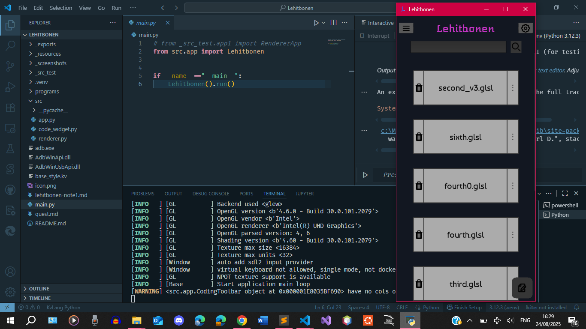
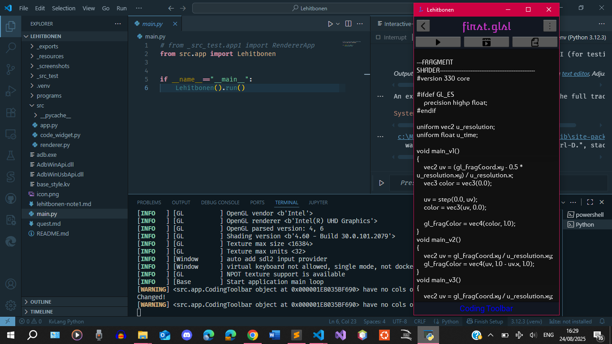
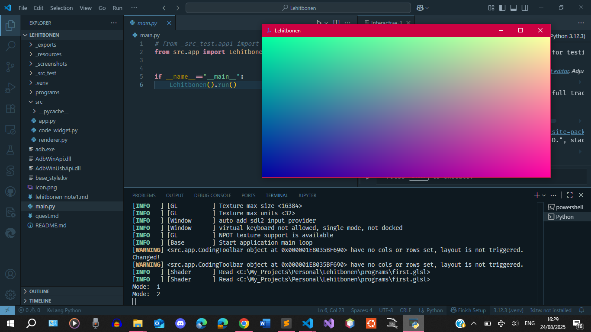
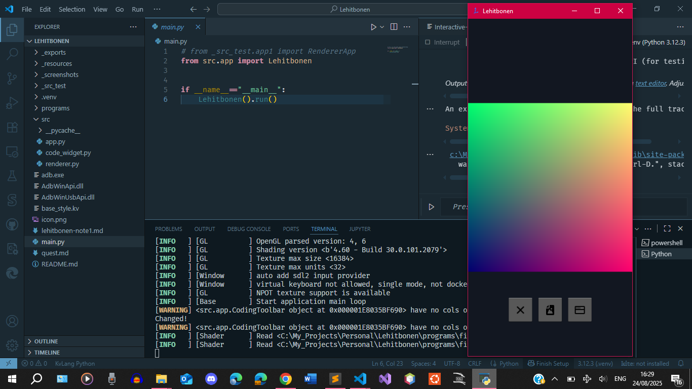
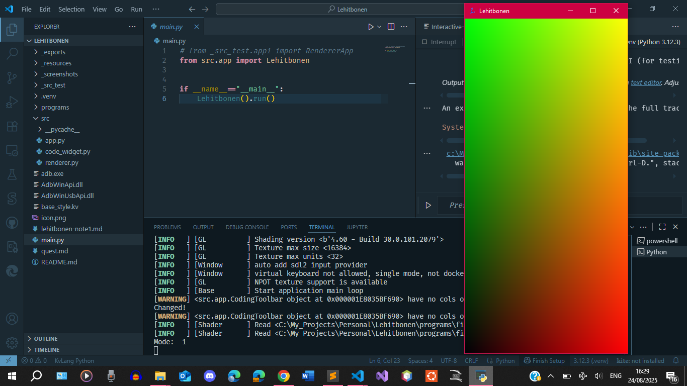
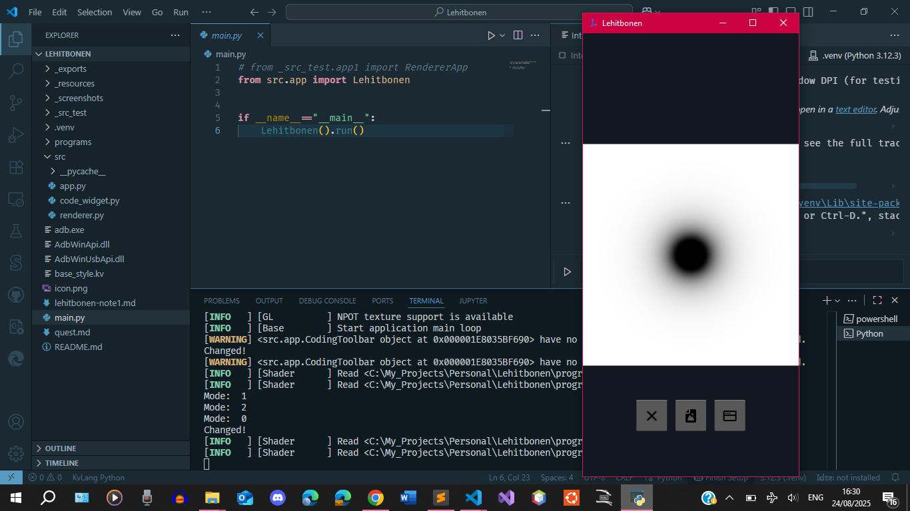
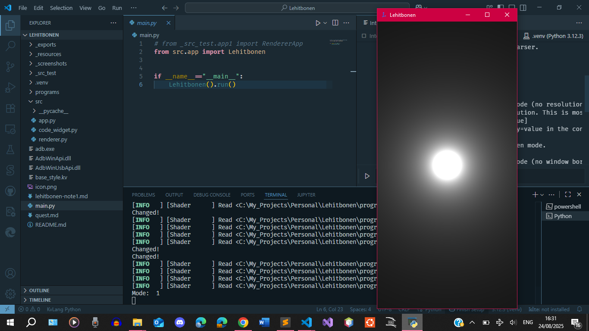

### Date: Wednesday 30th July, 2025

##  Lehitbonen להתבונן

It means "to contemplate" or "to gaze"

That is what this app is for. It's essentially my custom ShaderToy.

I use it where I do not have access to my computer to practice the GLSL shading language including
any ideas I may come up with. Because of the contemplation that goes behind understanding how to use
GLSL to create patterns, I named the app Lehitbonen.

###	Screenshots

